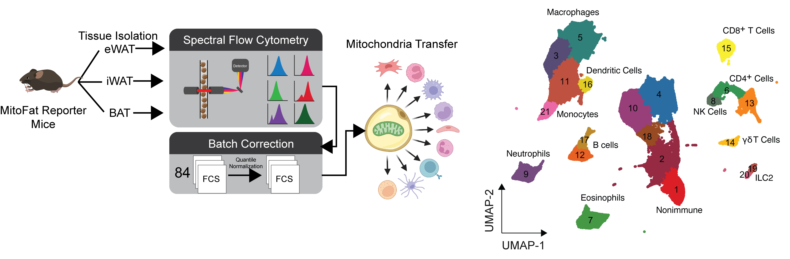

# Tracking intercellular mitochodnria transfer from adipocytes.
Dietary lipids regulate the transfer of adipocyte-derived mitochondria to a network of immune cells in white, beige, and brown fat.

## Abstract
Adipocytes transfer mitochondria to macrophages in white adipose tissue (WAT) and brown adipose tissue (BAT) to maintain metabolic homeostasis. In obesity, adipocyte-to-macrophage mitochondria transfer is impaired, and instead adipocytes release mitochondria into the blood to induce a protective antioxidant response in the heart. We found that adipocyte-to-macrophage mitochondria transfer is inhibited in murine obesity elicited by a lard-based high fat diet (HFD) but not a hydrogenated coconut oil (HCO)-based HFD, aging, or a corn starch diet. Long-chain fatty acids (LCFAs) enriched in lard suppress mitochondria capture by macrophages, diverting adipocyte-derived mitochondria into blood for delivery to the heart. Depletion of macrophages or inhibition of mitochondria transfer to macrophages with heparin rapidly increased adipocyte-derived mitochondria in blood. These findings suggest that dietary lipids regulate mitochondria uptake by macrophages locally in WAT to determine whether adipocyte-derived mitochondria are released into systemic circulation to support metabolic adaptation to nutrient stress.

## Repository Structure

├── ./R #this includes the mnn.overlay function written for supplemental figures
├── ./data
│   ├── /proccessed #contain inegratedDF.rds, which has the all info used to generate the UMAPs
├── ./tables #summary and annotation information
├── ./www #contains the abstract figure for the repository
├── README.md #what you are reading right now
└── mainFigures.Rmd #All the code used to generate R-based main figures

## Data
- Processed data is available in the github repo under **./data/IntegratedDF.rds**
- Unprocessed flow cytometry standard (.fcs) will be available at [here](https://zenodo.org/record/6538130) (embargoed until publication). The code will work if these .fcs files are downloaded and then placed in the ./data directory.
